# Hashing
- Set Implementations, DataIndexedIntegerSet
- Binary Representations, DataIndexedSet
- Handling Collisions
- Hash Functions

## Limitations of BST
- Items must be comparable
- Maintaining bushiness is non-trivial
- $\Theta(log N)$, can we do better?

-> Using data as an Index, but this approach wastes a lot of memory which requires generalizing for improving

-> for both contains and insert, they cost $\Theta(1)$ of runtime

## Common issues
- Collision handling
- Computing a hashCode
  - Java requires that EVERY object provide a method that converts itself into an integer: hashCode()

## Handling Collision
- Pigeonhole principle
- Could utilize external chaining to avoid the collision -> still need to be aware of lengthly chaining (bucket count) -> could fix the problem by using modulus of hashcode
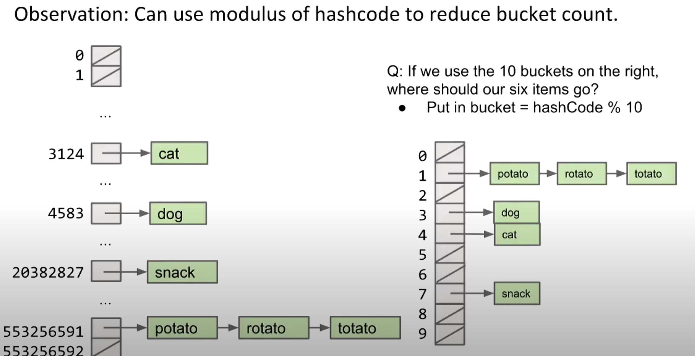

- The way to evaluate the effectiveness is through calculating **load factor**, which is $N/M$ ($N$ item and $M$ bucket) -> Average runtime is $\Theta (L)$
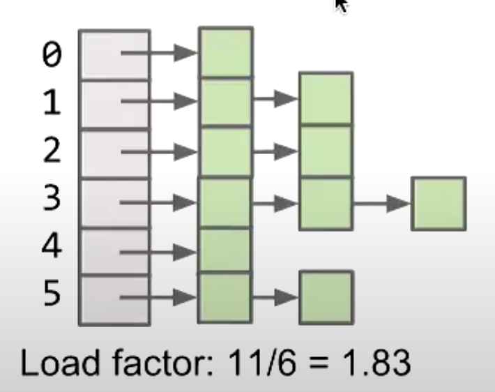

## Hash table
- Every item is mapped to a bucket number using a hash function
- Hash function is computed with two steps:
  - Computing a hashCode
  - Computing index = hashCode modulo M
- If load factor gets too large, increase the amount of bucket
- For solving collision, two common techniques:
  - External Chaining
  - Open Addressing (may come up at job interviews)
- Java provides a hash table based implementation of sets and maps:
  - **HashSet** and **HashMap**
  - Two warning:
    - never store mutable objects
    - never override *equals* without also overriding *hashCode*

# Heaps

## Priority Queue
- Implementation: allowing tracking and removal of the smallest item in a priority queue
  - Methods:
    - add(Item)
    - getSmallest()
    - removeSmallest()
    - size()
- Which data structure is best for implementing a MinPQ?
  - Ordered array? -> add(), remove() are slow
  - Bushy BST? -> maintaining bushiness is annoying. **Handling duplicate priorities is awkward**.
  - HashTable? -> no good! Items go into random places. hard to locate smallest.
  - **Heap** is the solution!

## Heaps
- Binary min-heap: Binary tree that is **complete** and obeys **min-heap property**
  - Min-heap: Every node is less than or equal to both of its children.
  - Complete: Missing items only at the bottom level (if any), all nodes are **as far left as possible**.
- Functionality:
  - returnSamllest(): return the root
  - add(): add to end of heap -> reorder the hierarchy to keep the tree complete
  - removeSmallest(): delete the root -> swap the root with the last node of the heap -> reorder the hierarchy to keep the tree complete

## How to represent a Tree?
- Aproach 1a, 1b, 1c: Create mapping from node to children
```java
// 1a
public class Tree1A<Key> {
  Key k;
  Tree1A left;
  Tree1A middle;
  Tree1A right;
}

// 1b
public class Tree1B<Key> {
  Key k;
  Tree1B[] children;  // store the link to each children
}

// 1c
public class Tree1C<Key> {
  Key k;
  Tree1C favoredChild;
  Tree1C sibling;
}
```
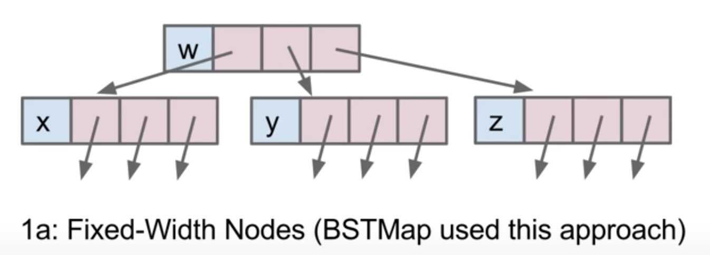
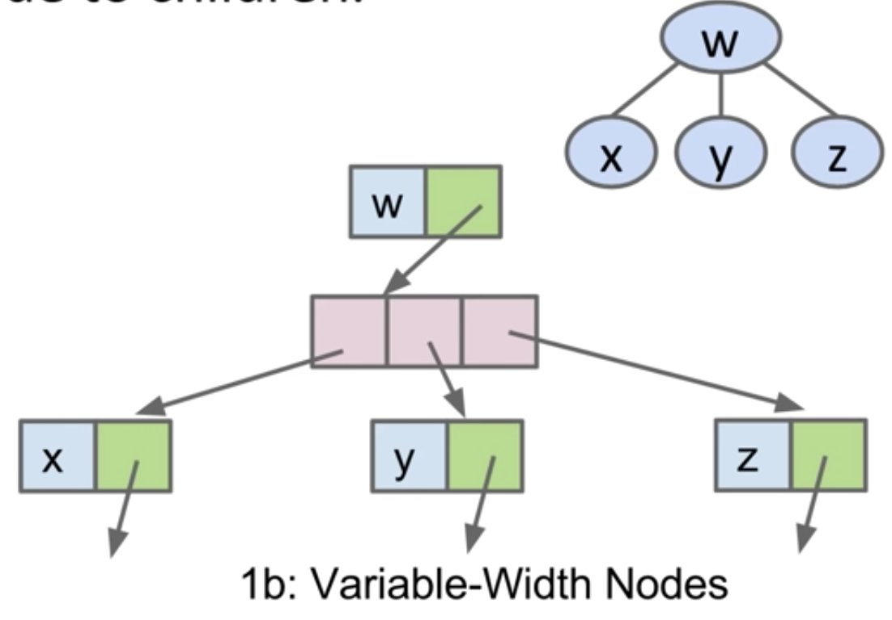
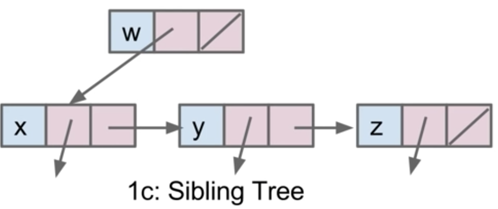

- Approach 2: Store keys in an array. Store parentIDs in an array.
```java
public class Tree2<Key> {
  Key[] keys;
  int[] parents;
}
```
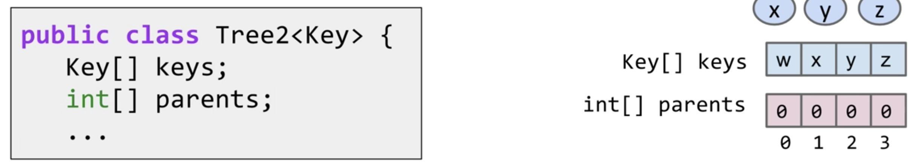
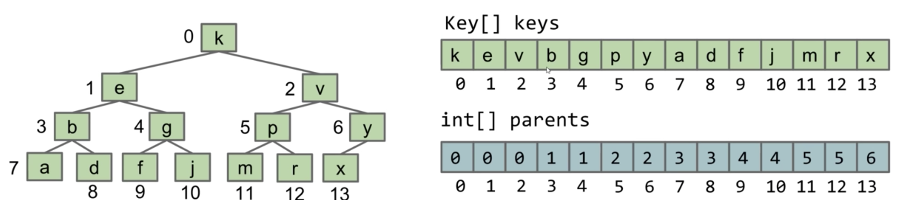

- Approach 3: Store keys in an array. Don't store structure anywhere
  - Assuming tree is complete
```java
public class Tree3<Key> {
  Key[] keys;
}

public void swim(int k) {
  if (keys[parent(k)] > keys[k]) {
    swap(k, parent(k));
    swim(parent(k));
  }
}

/* Utilize the relationship among the array's indexes */
public int parent(int k) {
  return (k-1)/2;
}
```
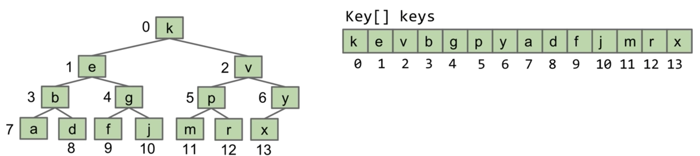

## Heap Implementation of a Priority Quere(PQ)
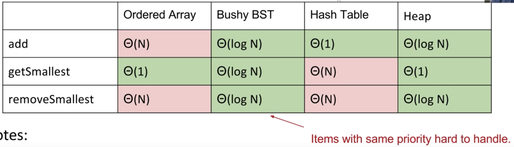
- **Array-based heaps take less memory**

# Data Structures Summary
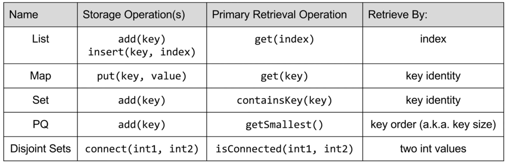
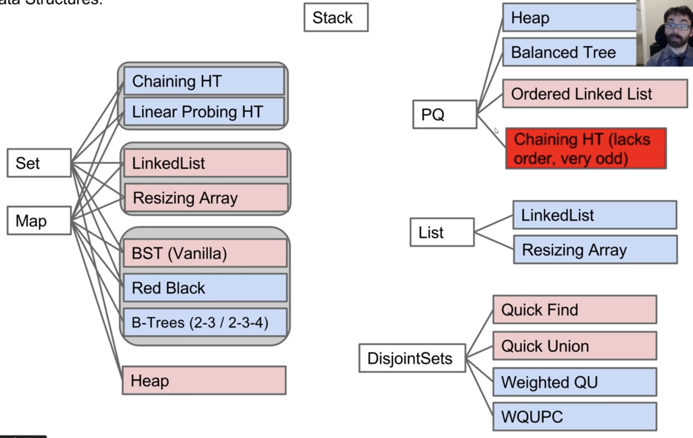 

# Tree Traversals, Quad Trees
- Tree Traversals
- Level Order Traversal
- Range Finding
- Spatial (a.k.a. Geometric) Trees
- Tree Iterators (Extra)

## Traversals
- Tree iteration is usually called "tree traversal"
- Tree Traversal:
  - Level Order
  - Depth First Traversals: preorder, inorder, postorder
    - Preorder: "Visit" a node, then traverse its children

```java
preOrder(BSTNode x) {
  if (x == null) return;
  print(x.key);
  preOrder(x.left)
  preOrder(x.right)
}

inOrder(BSTNode x) {
  if (x == null) return;
  inOrder(x.left);
  print(x.key);
  inOrder(x.right);
}

postOrder(BSTNode x) {
  if (x == null) return;
  postOrder(x.left);
  postOrder(x.right);
  print(x.key);
}
```
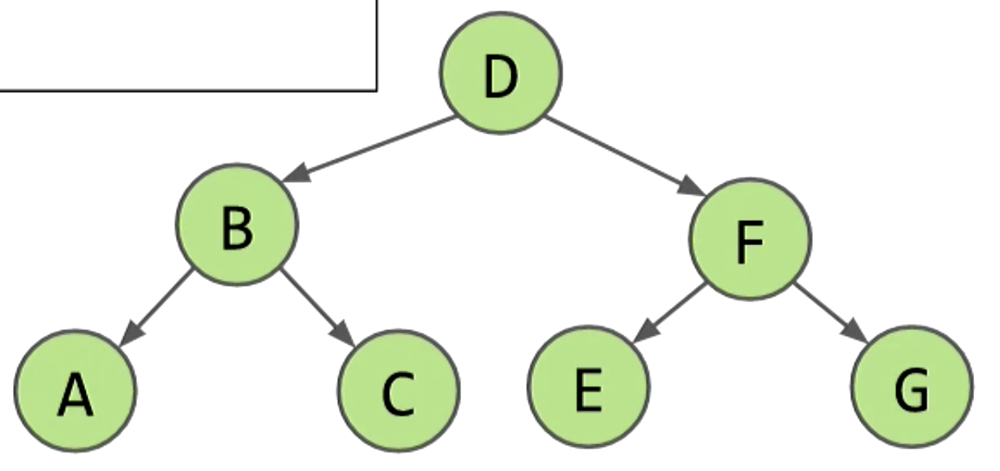

- Preorder: D B A C F E G
- Inorder: A B C D E F G
- Postorder: A C B E G F D

- When writing general tree traversal code. Avoid rewriting traversal for every task of interest (print, sum filesizes, etc.) by using the Visitor pattern.
```java
void preorderTraverse(Tree<Label> T, Action<Label> whatToDo) {
  if (T == nul) { return; }
  whatToDo.visit(T);  /* before we hard coded a print */
  preorderTraverse(T.left, whatToDo);
  preorderTraverse(T.right, whatToDo);
}

interface Action<Label> {
  void visit(Tree<Label> T);
}

class FindPig implements Action<String> {
  boolean found = false;
  @Override
  void visit(Tree<String> T) {
    if ("pig".equals(T.label)) {
      found = true;
    }
  }

preorderTraverse(someTree, new FindPig());
}
```

## Level Order Traversal
```java
public void levelOrder(Tree T, Action toDo) {
  for (int i = 0; i < T.height(); i += 1) {
    visitLevel(T, i, toDo)
  }
}

public void visitLevel(Tree T, int level, Action toDo) {
  if (T == null) 
    { return; }
  if (lev == 0)
    { toDo.visit(T.key); }
  else {
    visitLevel(T.left(), lev - 1, toDo);
    visitLevel(T.right(), lev - 1, toDo);
  }
}
```
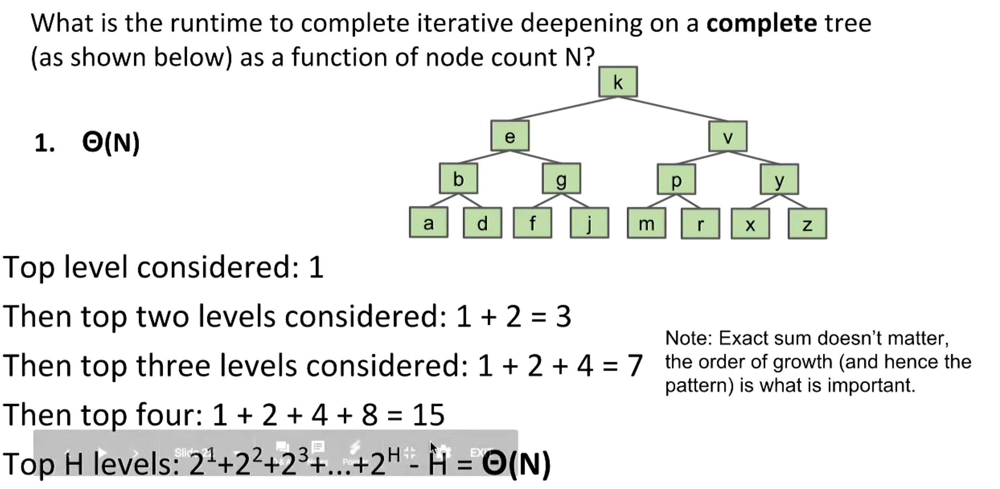
- complete tree (height: $\Theta(\log (N))$)

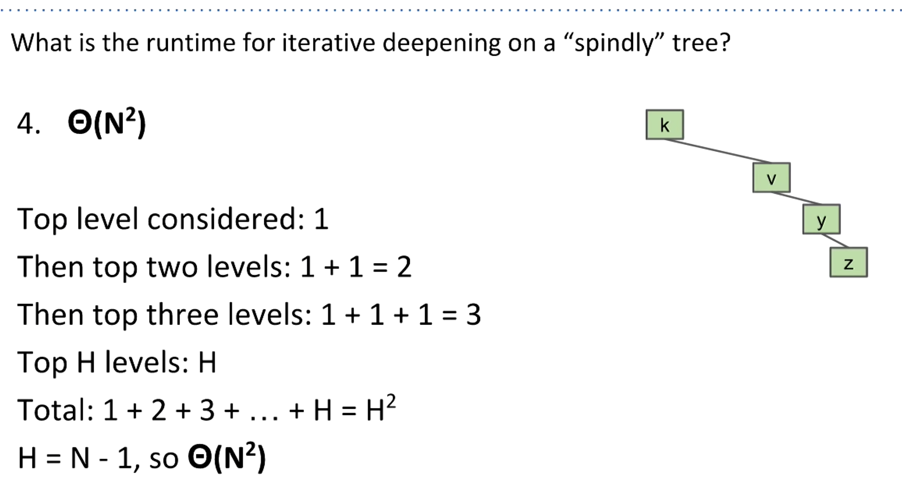
- spindly tree (height: $\Theta(N)$)

## Range Finding
- Suppose we want an operation that returns all items in a range
```java
public Set<Label> findInRange(Tree T, Label min, Label max)
```
- **Pruning**: Restricting our search to only nodes that might contain the answers we seek
  - Runtime: $\Theta(\log(N) + R)$
  - N: Total number of items in tree
  - R: Number of matches

## Spatial Trees
- QuadTrees: Divide and conquer by splitting 2D space into four quadrants
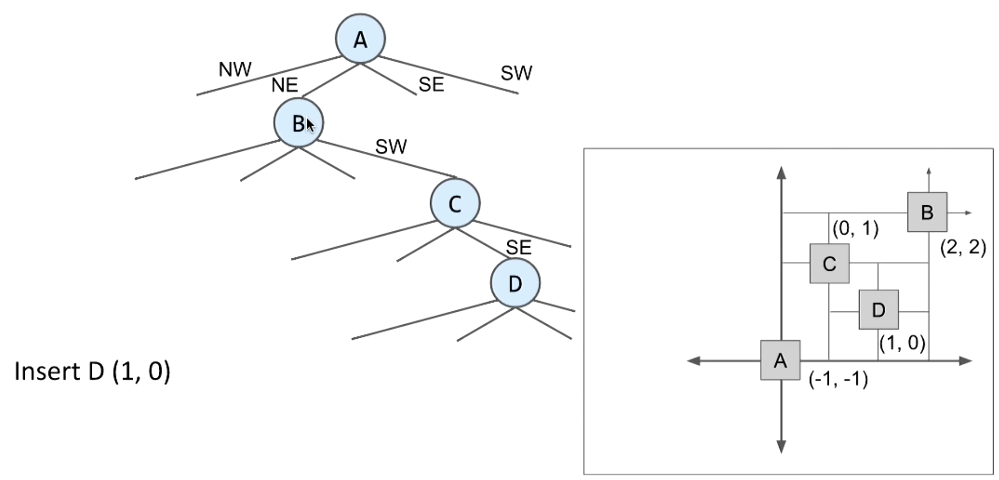
- Quadtrees allow us to proune when performing a rectangle search
  - Basic ruls: check overlap