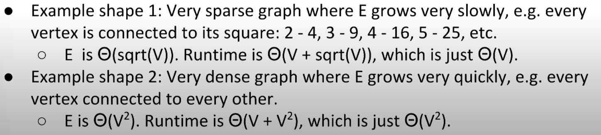
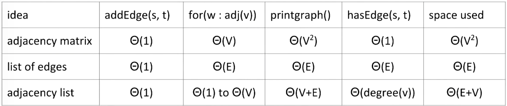
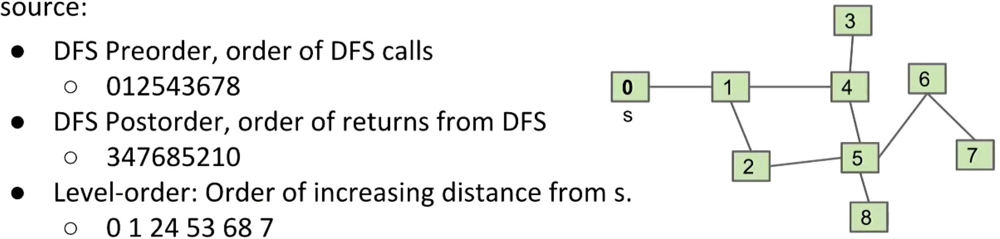

# Graphs: A set of nodes (a.k.a. vertices) connected pairwise by edges
- Graph Implementations
- Depth First Traversal

## Graph Types:
- Acyclic <-> Cyclic
- Directed <-> Undirected

## Graph Terminology:
- **vertices**, a.k.a. nodes
- **edges**: pairs of vertices
- A **path** is a sequence of vertices connected by edges
- A **cycle** is a path whose first and last vertices are the same
- Two vertices are **connected** if there is a path between them

## Graph-Processing Problems:
- s-t Path
- Shortest s-t Path
- Cycle
- Euler Tour: Is there a cycle that uses every vertex exactly once?
- Connectivity: Is there a path between all vertex pairs?
- Biconnectivity: Is there a vertex whose removal disconnects the graph?
- Planarity: no overlapping?
- Isomorphism: Are two graphs the same?

## Graph Representation:
```java
public class Graph {
    public Graph(int V):    // Create empty graph with v vertices
    public void addEdge(int v, int w):  // add an edge v-w
    Iterable<Interger> adj(int v):  // vertices adjacent to v
    int V():    // number of vertices
    int E():    // number of edges

    public static int degree(Graph G, int v)    // degree = # edges
}
```

- Representation 1: Adjacency Matrix
  - Runtime of the traversing print? -> $\Theta(V^2)$
- Representation 2: Edge Sets (list of edges): Collection of all edges, e.x. (src, target)
- Rep. 3: Adjacency lists (Common approach)
  - Runtime of the traversing print? -> $\Theta(V + E)$
  - Best case: $\Theta(V)$; Worst case: $\Theta(V^2)$




## Depth-First Traverse:
- Basic concept: Search for a path between two nodes, but visit each vertex at most once 
```java
public class Paths {
    public Paths(Graph G, int s):    // Find all paths from G
    boolean hasPathTo(int v):        // is there a path from s to v?
    Iterable<Integer> pathTo(int v): // path from s to v (if any)
}
```
- Guaranteed to reach every node
- Runs in $O(V + E)$ time

# Graph Traversals:
- DepthFirstPaths Implementation
- General Graph Traversals
- Topological Sorting
- Breadth First Search

## General Graph Traversals
- DFS Preorder, order of DFS calls
- DFS Postorder, order of returns from DFS
- Level-order: Order of increasing distance from s


## Topological Sort:
- Problem Description: Find an ordering of vertices consistent with directed edges
- Solution: Reverse of the postorder traversal

## Breadth First Search:
- Initialize a queue with a starting vertex s and mark that vertex (so called **fringe**)
- Repeat until queue is empty:
  - Remove vertex v from queue
  - For each unmarked neighbor of v: mark, add to queue, set its edgTo = v
- Runs in V+E time and uses V space


