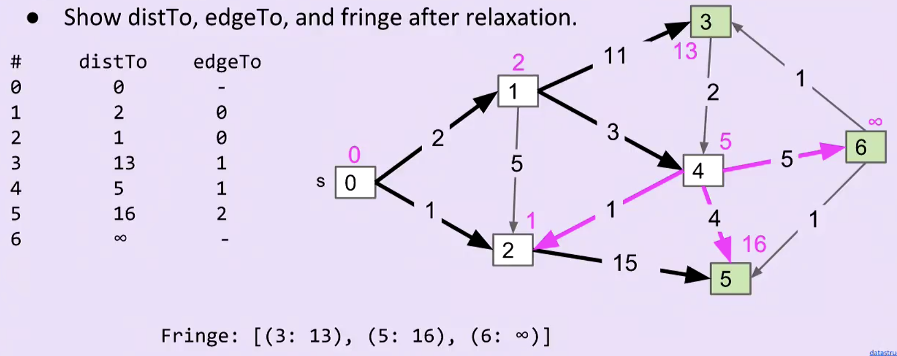

# Shortest paths:
- Dijkstra's Algorithm
- A*

## Dijkstra's Algorithm
- Goal: Find the shortest paths from **source** vertex s to some **target** vertex t
  - Observation; Solution will always be a path with no cycles (assuming non-negative weights)
- Goal: Find the shortest paths from **source vertex s** to **every** other vertex
  - Oobservation; Solution will always be a **tree**: cannot include cycles, every node has one parent
  - How many edges are in the Shortest Paths Tree (SPT) of G? **V-1**,  where V is the number of vertices
- Use **Best-First Search**
- Procedure:
  - initiate distTo and edgeTo; from the source, choose path to its neighbor node; update edgeTo if distTo is smaller (fringe after relaxation)
  - Fringe store the distance to untraversed vertices. Fringe is ordered by distTo. Must be a specialPQ.
```python
Fringe = [(6, 10), (3, 13)] # example of fringe
```


- Dijkstra's Runtime: Priority Queue operation count
  - Insertion: V, each costing $O(\log V)$ time.
  - Delete-min: V, each costing $O(\log V)$ time.
  - decreasePriority: E, each costing $O(\log V)$ time.
  - Overall: $O(V*\log(V) + V*\log(V) + E*\log(V))$ -> Assuming $E > V$, this is just $O(E \log(V))$

## A*
- Visit vertices in order of d(START, v) + h(v), where **h(v) is an estimate of the distance from v to END**
- Most of the operation will be similar as Dijkstra, only that **the Fringe will be updated with (distTo + h(v))**
- Why does this work? "using experience to learn and improve" -> line distance!!! 

# Minimum Spanning Trees
