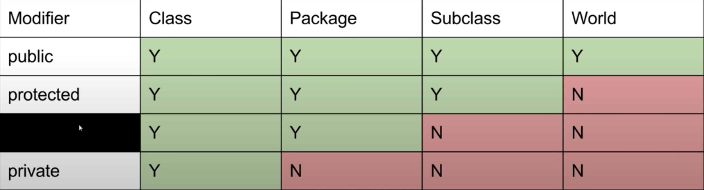

---
# Lecture 7
---
## Packages and JAR Files
- To address the fact that classes might share names
- Two steps to create a package:
  - Put the package name at the top
  - organize the folder directory
- Using packages: use canonical name

## The Default Package
- any Java class without a package name at the top are part of the "default" package
- cannot be imported

## JAR Files
- a single .jar file contains all of .class files
- File -> Project Structure -> Artifacts
- just a zip file

## Build Systems
- Ant
- Maven
- Gradle

## Access Control
- private
- public
- protected: class, package, subclass can access it
- package private: class and package can access it; declarations are parts of the implementation of a package that other members of the package will need to complete the implementation
