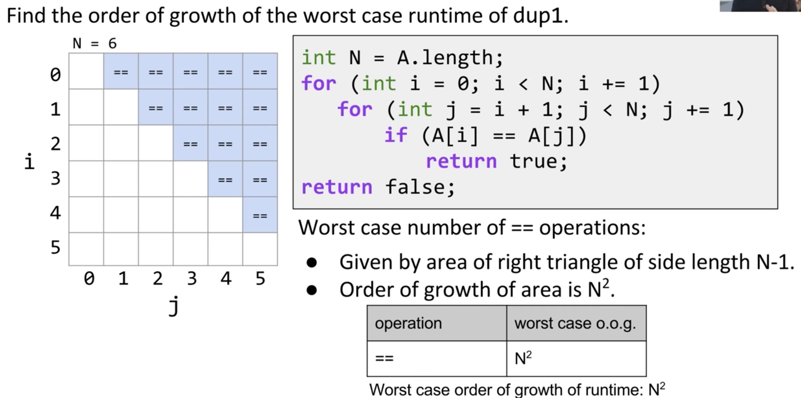
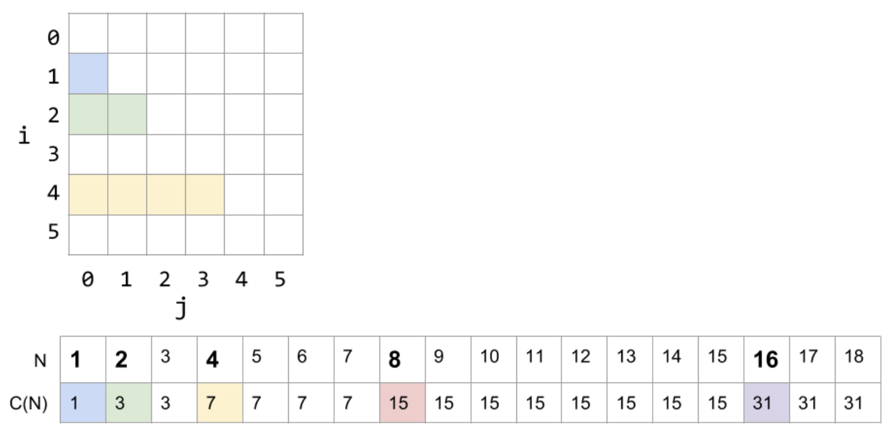

## Efficient programming comes in two flavors:
- Programming cost: develop, read, modify, and maintain
- Execution cost: execute, memory

## Encapsulation:
- Two terms:
    - Module: a set of methods that work together as as whole to perform some task or set of related tasks
    - Encapsulated: A module is said to be encapsulated if its implementation is completely hidden, and it can be accessed only through a documented interface

## API's: Application Programming Interface
- the list of constructors and methods and a shopr description of each
- consists of syntactic and semantic specification

## ADT's: Abstract Data Structures
- high-level types that are defined by their behaviors, not their implemetation.

## Example of Algorithm Cost:
- Objective Determine if a sorted array contains any duplicates
- How to characterize the runtimes of different algorithms
    - should be simple and mathematically rigorous
    - should demonstrate superiority
    
For example: 
1. timer (simulation):
    - pros: easy to measure, meaning is obvious
    - cons: require large amounts of computation time, result varies with machine, compiler, input data
2. count possible operations:
    - pros: machine independent
    - cons: tedious to compute, arbitrary array size, no actual time
    
3. Count possible operations in terms of input array size N:
    - pro: machine independent, tells the algorithm scales
```java
for (int i = 0; i < A.length; i += 1) {
    for (int j = i + i; j < A.length; j += 1) {
       if (A[i] == A[j]) {
        return true;
        }
    }
}
return false;
//                      N = 10000       symbolic count
// i = 0                1               1
// j = i + 1            1 to 10000      1 to N
// less than (<)        2 to 50015001   2 to (N^2+3N+2)/2
// increment (+=1)      0 to 5000500    0 to (N^2+N)/2
// equals (==)          1 to 49995000   1 to (N^2-N)/2
// array accesses       2 to 99990000   2 to N^2-N
```
- In most cases, we care only about asymptotic behavior, i.e. *what happens for very large N*
- We refer the "shape" of a runtime function as its ***order of growth***.

So, how to characterize the runtimes of functions:
1. Consider only the worst case
2. Restrict attention to one operation (the most critical one)
   1. good choice: increment -> the choice is called **cost model**
3. Eliminate low order terms
4. Eliminate multiplicative constants
 -> think geometrically (the area)

## Formalizing Order of Growth
- Big-Theta: $R(N) \in \Theta(f(N))$
- Examples:
  - $N^3 + 3N^4 \in \Theta(N^4)$
- Formal definition:
  - $R(N) \in \Theta(f(N))$: means there exist positive constants $k_1$ and $k_2$ such that: $k_1 * f(N) \leq R(N) \leq k_2 * f(N)$

## Two ways of approaching our runtime analysis
- Counting the number of operations
- Geometric argument 

## Another example
```java
public static void printParty(int N) {
   for (int i = 1; i <= N; i = i * 2) {
      for (int j = 0; j < i; j += 1) {
         System.out.println("hello");   
         int ZUG = 1 + 1;
      }
   }
}
```

= $C(N) = 1 + 2 + 4 + ... + N (if N is a power of 2).$

In sum, two important sum to memorize:
1. $1 + 2 + 3 + ... + Q = Q(Q+1)/2 = \Theta(Q^2)$
2. $1 + 2 + 4 + ... + Q = 2Q - 1 = \Theta(Q)$

## Recursion
```java
public static int f3(int n) {
   if (n <= 1) 
      return 1;
   return f3(n-1) + f3(n-1);
}
```
$C(1)=1; C(2) = 1 + 2C(2)=1+2; C(3) = 1 + 2 + 4C(3)=1+2+4$
$C(N)=1 + 2 + 4 + ... + 2^N - 1$

Applying this formula to the sum of $1 + 2 + 4 + ... + Q = 2Q - 1 = \Theta(Q)$

## Binary Search
- Compare key against middle entry
  - Too small, go left
  - Too big, go right
  - Equal, found
- Order of growth of the worst case runtime
  - $log_2 N$
  - Problem size halves over and over until it gets down to 1
  - Think of $C$ as the time we need to cut the array into half: $1 = (N/2)^C$ -> $C = log_2 N$ 
  - Exact count = $C = log_2 N \text{(floor)} + 1$
- Requires the list to be in sorted order


