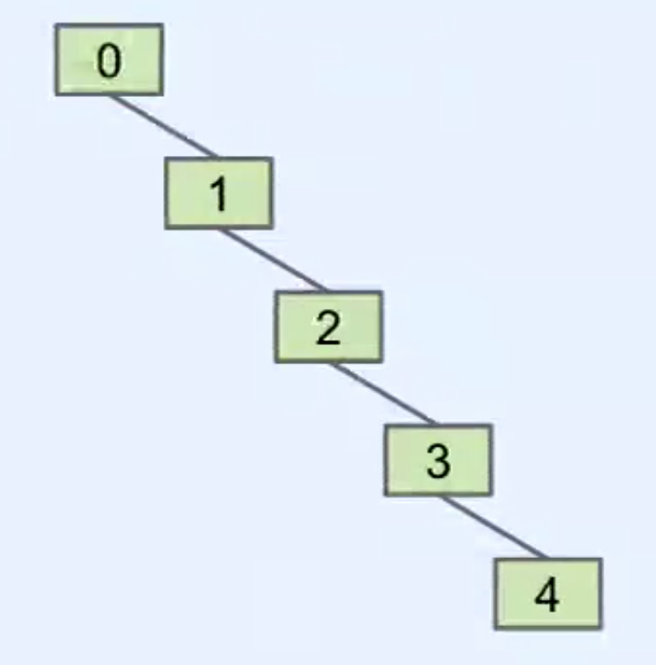
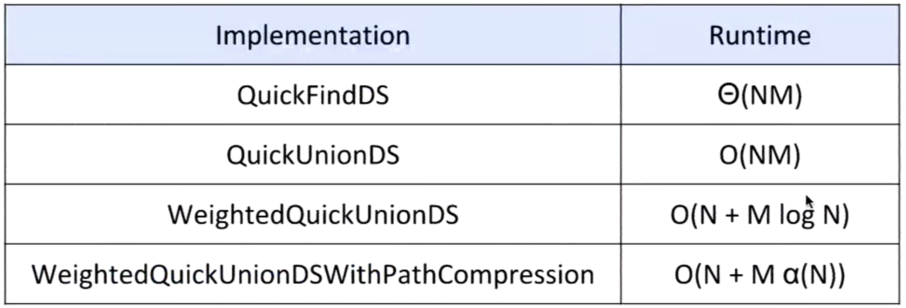

# Disjoint Sets

## Disjoint Sets
- Dynamic Connectivity and the Disjoint Sets Problem
- Quick Find
- Quick Union
- Weighted Quick Union
- Path Compression

## Dynamic Connectivity
- Determine if two items are connected transitively
- Two operations:
  - connect(p, q): Connect item p and q
  - isConnected(p, q): Are p and q connected?
```java
public interface DisjointSets {
    /* Connects two items P and Q. */
    void connect(int p, int q);

    /* Checks to see if two items are connected. */
    boolean isConnected(int p, int q);
}
```

- Implementation:
  - Naive: record every connection in line -> poor efficiency
  - Better: Connected Components (a.k.a. **Sets**)

## Quick Find
- For each item, record its boss; when connect happens, all related items need to be checked
- To check the connectivity, we only need to compare their list value
- Performance:
  - Constructor: $\Theta(N)$
  - connect: $\Theta(N)$
  - isConnected: $\Theta(1)$

```java
public class QuickFindDS implements DisjointSets {
    private int[] id;

    public QuickFindDS(int N) {
        id = new int[N];
        for (int i = 0; i < N; i++) {
            id[i] = i;
        }
    }

    /* Very fast: Two array accesses */
    public boolean isConnected(int p, int q) {
        return id[p] == id[q];
    }

    /* Relatively slow: N+2 to 2N+2 array accesses */
    public void connect(int p, int q) {
        int pid = id[p];
        int qid = id[q];
        for (int i = 0; i < id.length; i++) {
            if (id[i] == pid) {
                id[i] == qid;
            }
        }
    }
}
```

## Quick Union
- Pick a boss(a.k.a. parent) for each set; when connect happens, only one value need to be changed
- To check the connectivity, we need to check whether items' parents are the same (**Downside: finding the boss might be costly**)


- Performance:
  - Constructor: $\Theta(N)$
  - connect: $\Theta(N) \simeq O(N)$
  - isConnected: $\Theta(N) \simeq O(N)$

```java
public class QuickUnionDS implements DisjointSets {
    private int[] parent;
    public QuickUnionDS(int N) {
        parent = new int[N];
        for (int i = 0; i < N; i++) {
            parent[i] = i;
        }
    }

    /* Find the boss (Worst case: Theta of N */
    private int find(int p) {
        while (p != parent[p])
            p = parent[p];
        return p;
    }

    public boolean isConnected(int p, int q) {
        return find(p) == find(q);
    }

    public void connected(int p, int q) {
        int i = find(p);
        int j = find(q);
        parent[i] = j;
    }
}
```

## Weighted Quick Union (Advanced Quick Union)
- Modify quick-union to avoid tall trees
  - Track tree size (number or height are both ok, but number is easier to implement)
  - Always link root of smaller tree to larger tree
```java
public void connect(int p, int q) {
    int i = find(p);
    int j = find(q);
    if (i == j) return;
    // add-on the size of smaller node
    if (size[i] < size[j]) { parent[i] = j; isze[j] += size[i]; }
    else { parent[j] = i; size[i] += size[j]; }
}
```
- Performance:
  - Constructor: $\Theta(N)$
  - connect: $O(\log N)$
  - isConnected: $O(\log N)$

## Path Compression
- Compress each node's boss to the ultimate boss
- Performance: $M$ operations on $N$ nodes is $O(N + M \lg^* N)$, where $\lg^*$ is less than 5 for any realistic input
```java
private int find(int p) {
    if (p == parent[p]) {
        return p;
    } else {
        parent[p] = find(parent[p]);
        return parent[p];
    }
}
```

## Performance Summary

- DisjointSets object of size $N$
- Perform $M$ operations, where an operation is defined as either a call to connected or isConnected


# Binary Search Trees (BST)

## 