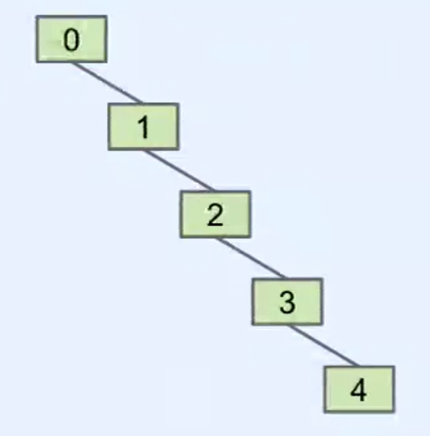
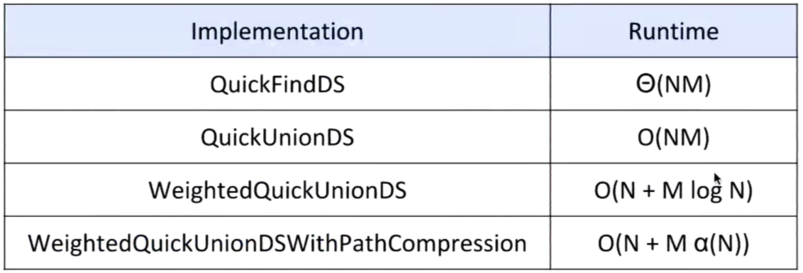
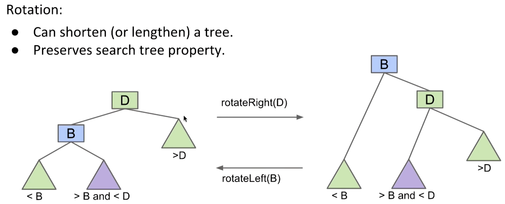
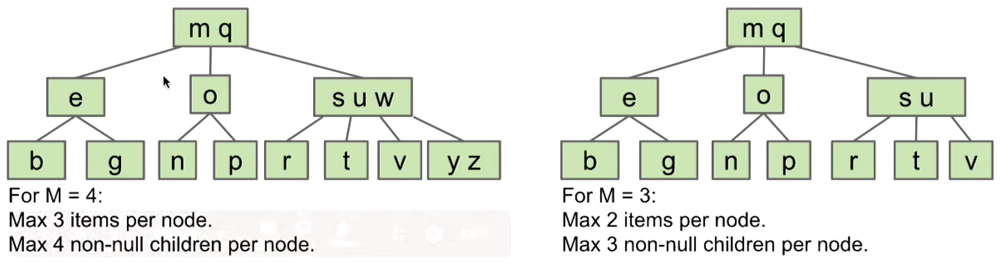
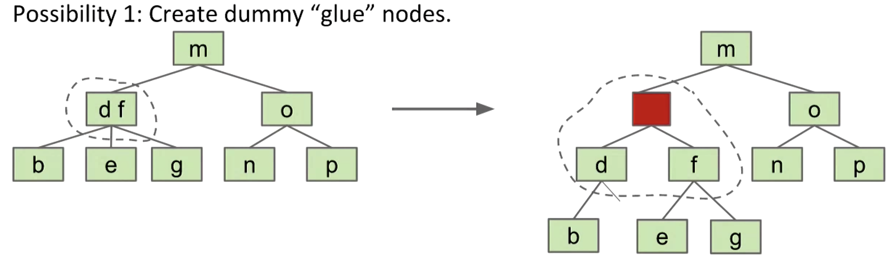
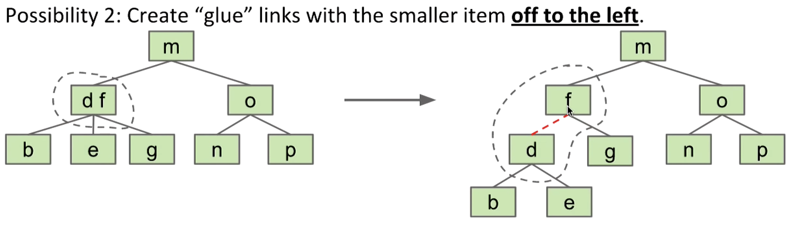
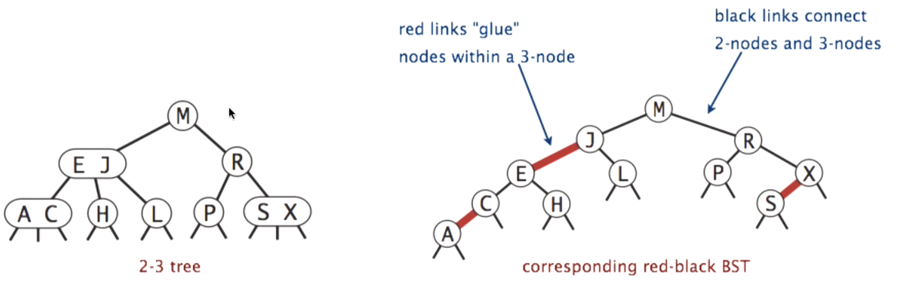

# Disjoint Sets

## Disjoint Sets
- Dynamic Connectivity and the Disjoint Sets Problem
- Quick Find
- Quick Union
- Weighted Quick Union
- Path Compression

## Dynamic Connectivity
- Determine if two items are connected transitively
- Two operations:
  - connect(p, q): Connect item p and q
  - isConnected(p, q): Are p and q connected?
```java
public interface DisjointSets {
    /* Connects two items P and Q. */
    void connect(int p, int q);

    /* Checks to see if two items are connected. */
    boolean isConnected(int p, int q);
}
```

- Implementation:
  - Naive: record every connection in line -> poor efficiency
  - Better: Connected Components (a.k.a. **Sets**)

## Quick Find
- For each item, record its boss; when connect happens, all related items need to be checked
- To check the connectivity, we only need to compare their list value
- Performance:
  - Constructor: $\Theta(N)$
  - connect: $\Theta(N)$
  - isConnected: $\Theta(1)$

```java
public class QuickFindDS implements DisjointSets {
    private int[] id;

    public QuickFindDS(int N) {
        id = new int[N];
        for (int i = 0; i < N; i++) {
            id[i] = i;
        }
    }

    /* Very fast: Two array accesses */
    public boolean isConnected(int p, int q) {
        return id[p] == id[q];
    }

    /* Relatively slow: N+2 to 2N+2 array accesses */
    public void connect(int p, int q) {
        int pid = id[p];
        int qid = id[q];
        for (int i = 0; i < id.length; i++) {
            if (id[i] == pid) {
                id[i] == qid;
            }
        }
    }
}
```

## Quick Union
- Pick a boss(a.k.a. parent) for each set; when connect happens, only one value need to be changed
- To check the connectivity, we need to check whether items' parents are the same (**Downside: finding the boss might be costly**)


- Performance:
  - Constructor: $\Theta(N)$
  - connect: $\Theta(N) \simeq O(N)$
  - isConnected: $\Theta(N) \simeq O(N)$

```java
public class QuickUnionDS implements DisjointSets {
    private int[] parent;
    public QuickUnionDS(int N) {
        parent = new int[N];
        for (int i = 0; i < N; i++) {
            parent[i] = i;
        }
    }

    /* Find the boss (Worst case: Theta of N */
    private int find(int p) {
        while (p != parent[p])
            p = parent[p];
        return p;
    }

    public boolean isConnected(int p, int q) {
        return find(p) == find(q);
    }

    public void connected(int p, int q) {
        int i = find(p);
        int j = find(q);
        parent[i] = j;
    }
}
```

## Weighted Quick Union (Advanced Quick Union)
- Modify quick-union to avoid tall trees
  - Track tree size (number or height are both ok, but number is easier to implement)
  - Always link root of smaller tree to larger tree
```java
public void connect(int p, int q) {
    int i = find(p);
    int j = find(q);
    if (i == j) return;
    // add-on the size of smaller node
    if (size[i] < size[j]) { parent[i] = j; isze[j] += size[i]; }
    else { parent[j] = i; size[i] += size[j]; }
}
```
- Performance:
  - Constructor: $\Theta(N)$
  - connect: $O(\log N)$
  - isConnected: $O(\log N)$

## Path Compression
- Compress each node's boss to the ultimate boss
- Performance: $M$ operations on $N$ nodes is $O(N + M \lg^* N)$, where $\lg^*$ is less than 5 for any realistic input
```java
private int find(int p) {
    if (p == parent[p]) {
        return p;
    } else {
        parent[p] = find(parent[p]);
        return parent[p];
    }
}
```

## Performance Summary

- DisjointSets object of size $N$
- Perform $M$ operations, where an operation is defined as either a call to connected or isConnected


# Binary Search Trees (BST)

## Analysis of an OLLMap<Character, ?>
- For **order linked list**, some operations take worst case linear time ($\Theta(N)$): get(), containsKey(), put().
- Optimization:
  - Extra links: add (random) links
  - Change the entry point: move pointer to middle and flip left links
  - Ultimately, halve every sublists, and build **Binary Search Tree**

## What is a Tree?
- A tree consists of:
  - A set of nodes
  - A set of edges that connect those nodes (Constraint: There is exactly one path between any two nodes)

## Binary Search Trees
- A rooted binary tree with the BST property
  - For every node X in the tree:
    - Every key in the left subtree is less than X's key
    - Every key in the right subtree is greater than X's key
- Ordering: complete, transitive, and antisymmetric. Furthermore, no duplicate keys allowed in CS61B
- BST Search: in the worst case, where $N$ is the number of nodes, runtime is $\Theta(\log N)$
- BST insert: 
- BST delete: three cases (no child, one child, *two children*)
  - For two children case, we need to find the maximum node in left subtree or the minimum node in right subtree

```java
// pseudo code for find
static BST find(BST T, key sk) {
    if (T == null)
        return null;
    if (sk.keyequals(T.label()))    // .label() returns the value of the given key
        return T;
    else if (sk < T.label())
        return find(T.left, sk);
    else
        return find(T.right, sk);
}

// pseudo code for insert
static BST insert(BST T, Key ik) {
    if (T == null)
        return new BST(ik);
    if (ik < T.label())
        T.left = insert(T.left, ik);
    else if (ik > T.label())
        T.right = insert(T.right, ik);
    return T;
}

// A common rookie bad habit to avoid (ARMS LENGTH RECURSION)
if (T.left == null)
    T.left = new BST(ik);
else if (T.right == null)
    T.right = new BST(ik);
```

# Balanced Search Trees
- 2-3-4 and 2-3 Trees (a.k.a. B-Trees)
- Tree Rotation
- Red-Black Trees

## Tree Rotation
- Keep the node order when adding new node into the tree

- Rotate after each insertion and deletion to maintain balance

## Search Trees:
- Common types
  - Binary search trees: require rotations to maintain balance
    - AVL, weight-balanceing, **red-black**
  - Treaps
  - Splay trees
  - **2-3** / **2-3-4 trees** / **B-trees**: no rotations required, but is often not practical to implmement

**Splitting Tree (2-3, 2-3-4 trees) a.k.a. B-trees**
- "Overstuffed tree": always has balanced height, because leaf depths never change; add node to exsisting leaf
  - Problem: leaf nodes can get too large -> solution: set a cap -> advanced solution: create a third child for saving in-between values
    - insert node costs $Z$ compares, but that's OK since $Z$ is capped (where $Z$ is the # of items in a node)
- For Splitting-trees (2-3, 2-3-4 trees), we only increase the depth when we need to split the root
  - All operations have guaranteed $\Theta(\log N) = \Theta(H)$ time. ($H$: Height)
  - Height: Between $\log_M(N)$ and $\log_2(N)$. ($M$: max number of children)

 left: 2-3-4 tree / right: 2-3 tree

- B-Trees have two specific contexts:
  - Small $M$ ($M=3$ or $M=4$): only conceptual
  - $M$ is very large (> thousand): used in practice for databases and filesystems
- Importantly, B-Trees are a real pain to implement, issues include:
  - Maintaining different node types
  - Interconversion of nodes between 2-nodes and 3-nodes
  - Walking up the tree to spli nodes

Red-Black Trees
- Use rotations to ensure the isometry (structurally identical to a 2-3 tree)
- Since 2-3 trees are balanced, rotations on BST will ensure balance
- Solution
  - Possibility 1: Create dummy "glue" nodes

  - Possibility 2: Create "glue" links with the smaller item *off to the left*

- 同一階層的 value 會透過紅色的 link 連接起來，往上下層的會用黑色的 link 連接起來，這邊的 link 皆為 pointer，只是在形式上做出區分

    - Some properties: 
      - traverse to two nodes at the same level of the tree will have the same amount of black links
      - For any 2-3 tree, there exists a corresponding red-black tree that has depth no more than 2 times the depth of the 2-3 tree